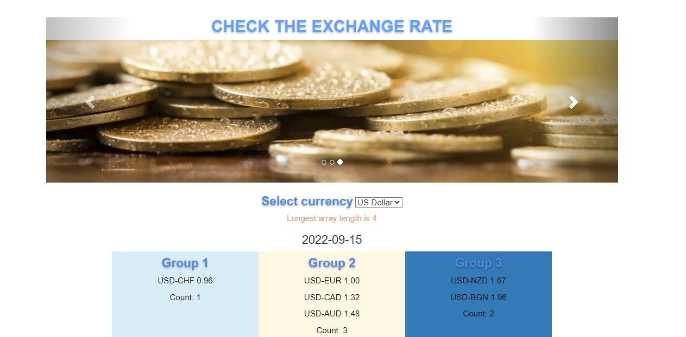

# Exchange rate

## Iliyana Pantaleeva 

SPA for checking the rate of the following currencies: USD, EUR, AUD, CAD, CHF, NZD, BGN, built with HTML, CSS and Bootstrap. 


## Installation as a developer

Make sure you have these installed

1. HTML
2. CSS
3. Bootstrap
4. GITHUB

Clone the repository

```
git clone https://github.com/lia-new/Exchange-rate
```

Make sure you are in the directory of your application.

## Project Description
Exchange rate is a SPA application. The user interface of the application consists of a drop-down menu with the following currencies: USD, EUR, AUD, CAD, CHF, NZD, BGN
The default currency selected is USD
When loading the application, the exchange rates between all possible pairs of the aforementioned currencies are obtained.
The page displays a list of exchange rates for the currently selected currency.
Tariffs are visualized divided into 3 groups:
Group 1 - all exchange rates that are < 1
Group 2 - all exchange rates that are >= 1 and < 1.5
Group 3 - all exchange rates that are >= 1.5
The groups are sorted by the value of the exchange rate, the number of items in this group is displayed.
When the user selects another currency from the drop-down menu, the application displays the exchange rates for the newly selected currency.
The page displays a number that is the length of the longest array, for array elements only the exchange rates for the currently selected currency should be considered.


## App views
  

